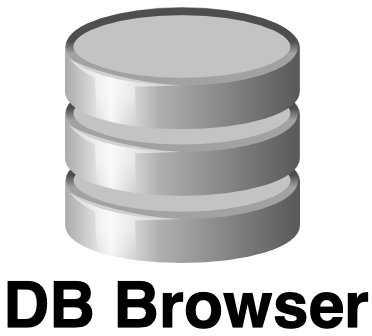
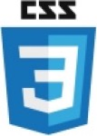
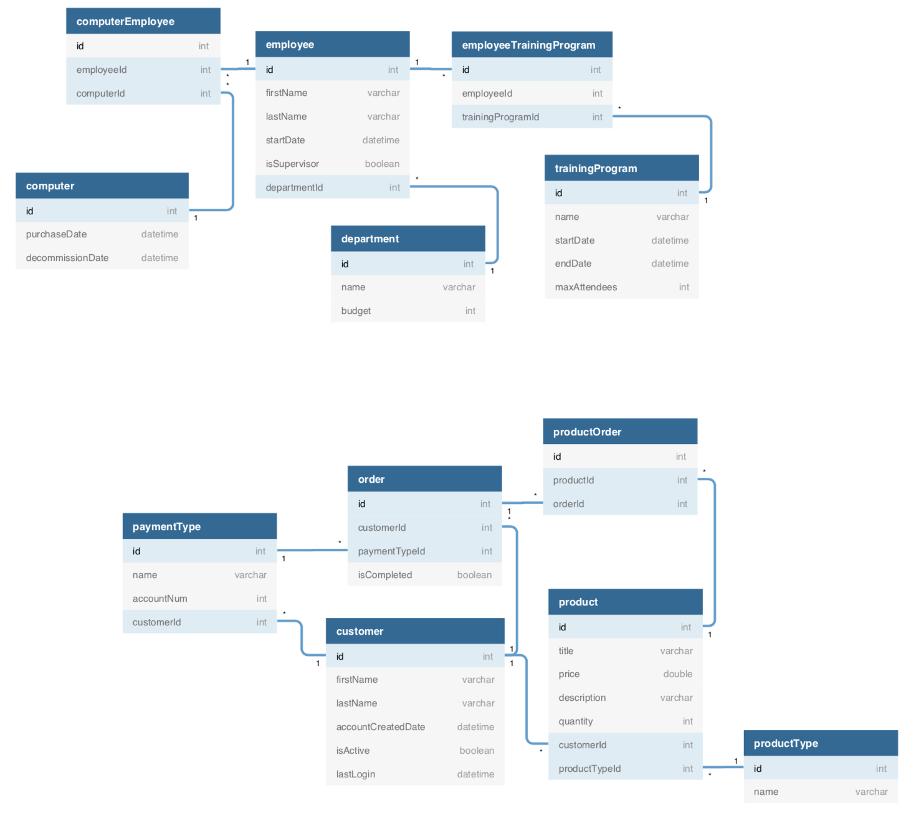

<h1 style="font-weight: bold">Bangazon</h1>


<h2 style="font-weight: bold">Career Resource Management Application</h2>

<h3>Bangazon is a project to develop a new app to manage Employees, Departments, Computers and Training Programs for an entire company. The requirements were issued as tickets and were completed by a team of 5. This project also includes the use of seeder data that autopopulates the database, as well as testing for Python fuctionality.</h3>

<h2 style="font-weight: bold;"> Technologies Used
<h3>Development Languages and Libraries</h3>

______________________________

<h1></h1>
<h3>Development Tools</h3>

__________________


<h2>Instructions for Installing Bangazon</h2>

<h4> You will need to have command line tools installed for your computer to use terminal commands.
</h4>

  * Mac users - Open your terminal and type

    ```sh
    git --version
    ```

  * Linux/Windows users, please vist the [Git page](https://git-scm.com/book/en/v2/Getting-Started-Installing-Git) and follow the instructions for setup

<h4>You will now need to configure your git account. In the terminal window, type</h4>

  ```sh
  git config –global user.name “You Name”
  git config –global user.email “Your Email”
  ```

#### Create a new directory to store the files in. Type this into your terminal window.

  ```sh
  mkdir Bangazon
  cd Bangazon
  git clone https://github.com/garrulous-gobies/Bangazon_1
  ```

#### If you do not have Python version 3 installed on your machine, visit the [Python Download Page](https://www.python.org/downloads/) or to install with command line,

```sh
/usr/bin/ruby -e "$(curl -fsSL https://raw.githubusercontent.com/Homebrew/install/master/install)"
brew install python
pip install django
pip install django-seed
```

#### Now you need to migrate the models into your local folder:
```sh
python manage.py makemigrations
python manage.py migrate
```


#### You can now populate the data by running

```sh
chmod +x django_data.sh
./django_data.sh Bangazon seeder
```

#### You can now run the program by typing:

```sh
python manage.py runserver 8080
```

<h1 style="text-align:center; font-weight: bold;">Congratulations! You are now experiencing Bangazon!

<h2 style="font-weight:bold;text-align:center" > Main functionality of Bangazon</h2>

1. When user clicks Employees in the navigation bar, a list will appear showing all employees.
1. When user clicks Departments in the navigation bar, a list will appear showing all departments.
1. When user clicks Computers in the navigation bar, a list will appear showing all computers.
1. When user clicks Training Programs in the navigation bar, a list will appear showing all future training programs.
1. When user clicks a specific Training Program while on the Training Programs page, details will appear displaying the Title, Description, Start Date, End Date, Max Enrollment, and Employees that are scheduled to attend.
1. When user is on a specific Training Program page and user clicks Edit Training, a form will appear with the current details displaying the Title, Description, Start Date, End Date, and Max Enrollment with a Save button and a Cancel Edits button.
1. When user clicks Save while on the Edit Training Programs page, the form will be checked for validation and the database will be updated with new information. The user will then be redirected to the main Training Page.
1. When user clicks Cancel Edits while on the Edit Training Programs page, the user will then be redirected to the main Training Page.
1. When user is on a specific Training Program page and user clicks Delete Training, the training will be removed from the database and the user will be redirected to the main Training Program page.
1. When user clicks Past Training Programs while on the Training Programs page, a list will appear showing all past training programs.
1. When user clicks a specific Training Program while on the Past Training Programs page, details will appear displaying the Title, Description, Start Date, End Date, Max Enrollment, and Employees that attended.


<h2 style="text-align: center">Entity Relationship Diagrams</h2>



<h2 style="text-align: center; font-weight: bold"> Visual Feature List</h2>

<h3 style="text-align: center">To help you along, here is a visualization of the features, and behaviors of the application to get you started.</h3>

<!-- ________________________________________________________ -->